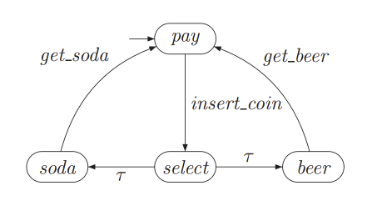

# MiniCheck

## Run

```
cabal update
cabal run miniCheck -- "./app/transition_system.txt" "./app/computation_tree_logic.txt"
```

positional argument 1: the path for the transition system file
positional argument 2: the path for the computational tree logic file

other examples

```
cabal run miniCheck -- "./app/transition_system.txt" "./app/computation_tree_logic.txt" --ts
cabal run miniCheck -- --help
cabal run miniCheck -- extensionmode --extensions
```

## Run all tests

```
cabal update
cabal test --test-show-details=direct
```

## Generate Documentation

Run

```
cabal haddock --haddock-executables
```

## Transition Systems (TS)

Formally, a TS is a tuple $(S, Act, \to, I, AP, L)$, where

- $S$ is a set of _states_,
- $Act$ is a set of _actions_,
- $\to \subseteq S x Act x S$ is a _transition relation_
- $I \subseteq S$ is a set of initial states
- $AP$ is a set of _atomic propositions_
- $L : S \to 2^{AP}$ is a labelling function.

### Text Representation



- states: _pay_, _select_, _soda_, _beer_
- actions: _get_soda_, _get_beer_, _insert_coin_

```ebnf
transition_system = definition | definition newline transition_system;
definition        = initial_state | normal_state | actions | transition | label_func;
initial_state     = "initial state" identifier {"," identifier};
normal_state      = "state" identifier {"," identifier};
transition        = "trans" identifier (identifier | "TRU€") identifier;
label_func        = "labels" identifier ":" label {"," label};
label             = ["-"] identifier;

newline           = "\n";
lower_char        = "a" | "b" | "c" | ... | "z";
identifier        = lower_char {"_" | lower_char};
```

To improve usability you can also write comments which are haskell like comments
and start with `--`.

Example:

```
initial states pay
states select, soda, beer
actions insert_coin, get_beer, get_soda

tr️ans soda get_soda pay
trans beer get_beer pay
trans pay insert_coin select
trans select TRUE beer           //internal transition
trans select TRUE soda

labels select: -x, y, -z, -a, b
```

## Computational Tree Logic (CTL)

```ebnf
ctl_system        = ctl_formula | ctl_formula newline ctl_system;
ctl_formula       = state_formula | path_formula;

state_formula     = "AP" identifier
                  | "NOT" "(" state_formula ")"
                  | "AND" "(" state_formula ")" "(" state_formula ")"
                  | "OR" "(" state_formula ")" "(" state_formula ")"
                  | "IMPLIES" "(" state_formula ")" "(" state_formula ")"
                  | "EQUIVALENT" "(" state_formula ")" "(" state_formula ")"
                  | "XOR" "(" state_formula ")" "(" state_formula ")"
                  | "EXISTS" "(" path_formula ")"
                  | "FORALL" "(" path_formula ")"
                  ;

path_formula      = "O" "(" state_formula ")"
                  | "U" "(" state_formula ")" "(" state_formula ")"
                  | "E" "(" state_formula ")"
                  | "A" "(" state_formula ")"
                  ;

newline           = "\n";
lower_char        = "a" | "b" | "c" | ... | "z";
digits            = "0" | "1" | "2" | ... | "9";
identifier        = lower_char {"_" | lower_char | digits};
```

To improve usability you can also write comments which are haskell like comments
and start with `--`.

Example:

```
FORALL (U (AND (AP ap1) (NOT (AP ap2))) (OR (AP ap3) (EXISTS (A (AP ap4)))))
```
